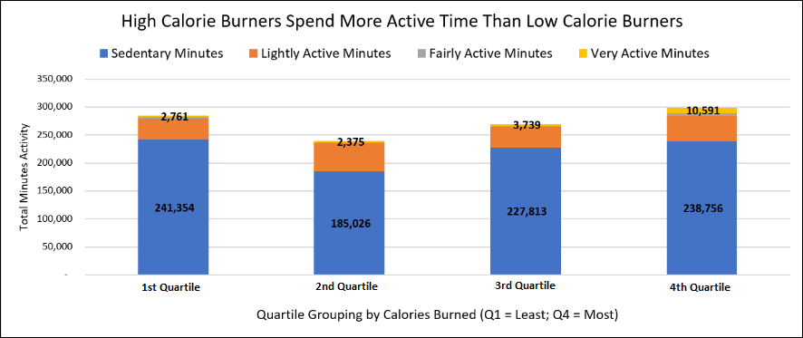
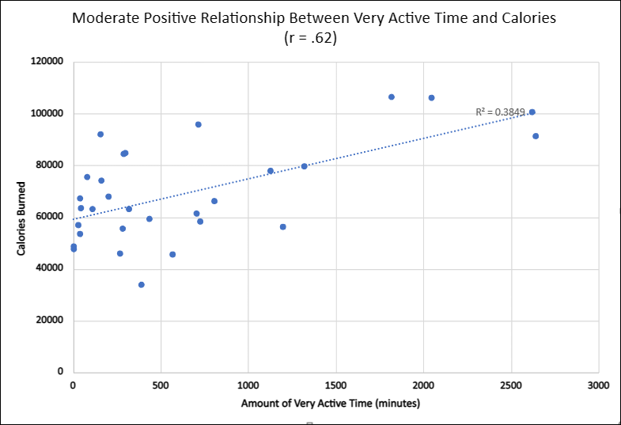

# Google Data Analytics Cert Capstone Project (Excel solution version)  
## Case Study 2 - Wellness Technology Trends  
### Statement of business task and research question:
* Identify relevant trends in wearable health tracking device usage, and make recommendations to influence company marketing strategy. 
* More specifically, where do people have "dips" in usage of these devices, associated with lower use? Recommendations therefore can reflect strategies that address these factors to increase wearable health tracking devices.   
### Measuring usage or activity
* The number of minutes for each day that show some kind of activity (Total Minutes Activity) will be one measure of overall device use. Another is the total number of calories burned for each day--i.e., the higher the daily activity, the higher the daily caloric consumption.  
* It should be noted that there were a number of Ss on some days (e.g., ID# 1503960366 on 5/12/2016) that appeared to have all minutes of activity logged (likely erroneously) within only one category (e.g., SendenaryMinutes). For these, the data were kept because the user likely did not choose the correct setting/option on the wearable device. By summing all active minutes columns, we get a total measure of activity regardless of what option/setting was selected by the user.  
### Data sources:
* The FitBit Fitness Tracker Data was downloaded from the following open source public site on 02-02-2023: https://www.kaggle.com/datasets/arashnic/fitbit
The data package downloaded includes the following files: 

**Daily Data**  
  [dailyActivity_merged.csv](https://github.com/vagombos/vagombos_Google_Capstone_Excel-only-version/blob/main/dailyActivity_merged.csv), dailyCalories_merged.csv, dailyIntensities_merged.csv, dailySteps_merged.csv 
      
  **Heart Rate Data**  
    heartrate_seconds_merged.csv  
      
  **Hourly Data**  
  hourlyCalories_merged.csv, hourlyIntensities_merged.csv, hourlySteps_merged.csv  
      
  **Minute Data**  
  minuteCaloriesNarrow_merged.csv, minuteCaloriesWide_merged.csv, minuteIntensitiesNarrow_merged.csv, minuteIntensitiesWide_merged.csv,         minuteMETsNarrow_merged.csv, minuteSleep_merged.csv,minuteStepsNarrow_merged.csv, minuteStepsWide_merged.csv  
      
  **Sleep Data**  
  [sleepDay_merged.csv](https://github.com/vagombos/vagombos_Google_Capstone_Excel-only-version/blob/main/sleepDay_merged.csv)   
      
  **Weight Data**  
  weightLogInfo_merged.csv  
    
### Data cleaning, merging, and transformations:
1. dailyActivity_merged.csv and sleepDay_merged.csv have relevant information about total activity and sleep in minutes; Total Minutes Activity(1) new calculated column as sum of VeryActiveMinutes, FairlyActiveMinutes, LightlyActiveMinutes, and SedendaryMinutes. 
2. Initial pivots for Total Minutes Activity and Total Calories showed that three people (IDs 2347167796, 3372868164, & 4057192912) had significant missing data and were excluded from further analysis, leaving N = 30.
3. VLOOKUP_ID was created as an index column between the DailyActivity and SleepDay sheets, consisting of concatentation of ID and ActivityDate
4. TotalTimeInBed from sleepDay data was added as a new column via VLOOKUP to the dailyActivity sheet. There were 23 out of the 30 Ss (77%) that also recorded sleep data. To ensure that a final measure of total activity in minutes only captures usage during waking hours, TotalTimeInBed was subtracted from Total Minutes Activity(1) to produce final measure Total Minutes Activity(2)
5. Day_of_Week derived column based on ActivityDate
6. Calorie Quartile Group created by assigning each participant by the total number of calories.  
	- Complete Excel file can be found here: 
	- The Activity_clean worksheet has the final data source; Pivots worksheet has the series of pivots and charts generated in Excel for the analyses

### Analyses and Visualizations:
- Pivots and charting of the Total Minutes of Activity for each Day of the Week.
- Scatterplot and trendline of relationship between Total Minutes Activity and Calories. Further breakdown of total activity by each intensity level (VeryActive, FairlyActive, LightlyActive, and Sedentary) via stacked bar chart. Pearson correlation coefficients calculated for relationships between VeryActive and FairlyActive, or just VeryActive, to Total Calories.
- Tabulation and charting of those participants that did or did not track their sleep data for (1) all days, (2) some days (not all 31 days), and no days. Average number of days for those who did chart at least some days calculated.

### Results:  
- Participants showed more activity/usage during the middle of the week (e.g., Tuesday, Wednesday, Thursday were highest) than on the weekends (Saturday and Sunday were lowest). 

- Although there was no correlation between Total Minutes of Activity and Calories burned across all participants, those participants that fell into the lowest quartile of calories burned appeared to have the most amount of sedentary time while participants in the highest quartile of calories burnedhad the most amount of very active time logged. 

	
	
- Further, when Very Active Time was correlated with Calories Burned, there was a significant moderate relationship.

	

- 23% of users did not track any sleep data during this time period; Of those that did track sleep, only 3 did for every day (87% only partially tracked their sleep data, with an average of 17 days of sleep data collected for all participants. 

### Conclusions and Recommendations:  
- **Takeaway #1**--_Participants use their wearable health device more in the middle of the week than on the weekends._ This may either mean that they are more physically active on those days, or they are logging their activity more. A recommendation for a marketing strategy is to emphasize more use of devices for weekend activities, or suggest ways to increase activity on weekends.  
- **Takeaway #2**--_Those people who were Very and/or Fairly active burned more calories; those that were more sedentary burned less calories._ A recommendation for marketing would be to showcase how wearable devices can help a person burn more calories by its ability to measure intensity of activity. If a person aims to get more Very Active or Fairly Active time in, they will likely see an increase in calories burned.  
- **Takeaway #3**--_Users are not reliably capturing sleep data._ Even for those who did use their devices while sleeping, most only captured sleep data for about half of the time period. A recommendation for marketing is to motivate users to collect more sleep data, emphasizing that this is another important facet of health that shouldn't be missed.  
